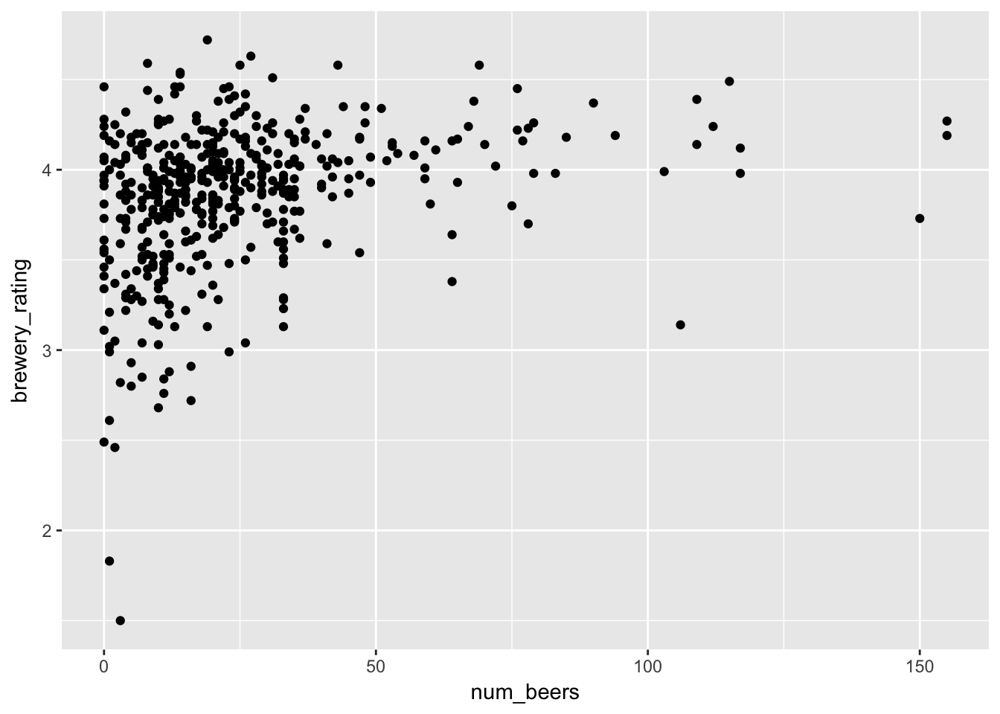
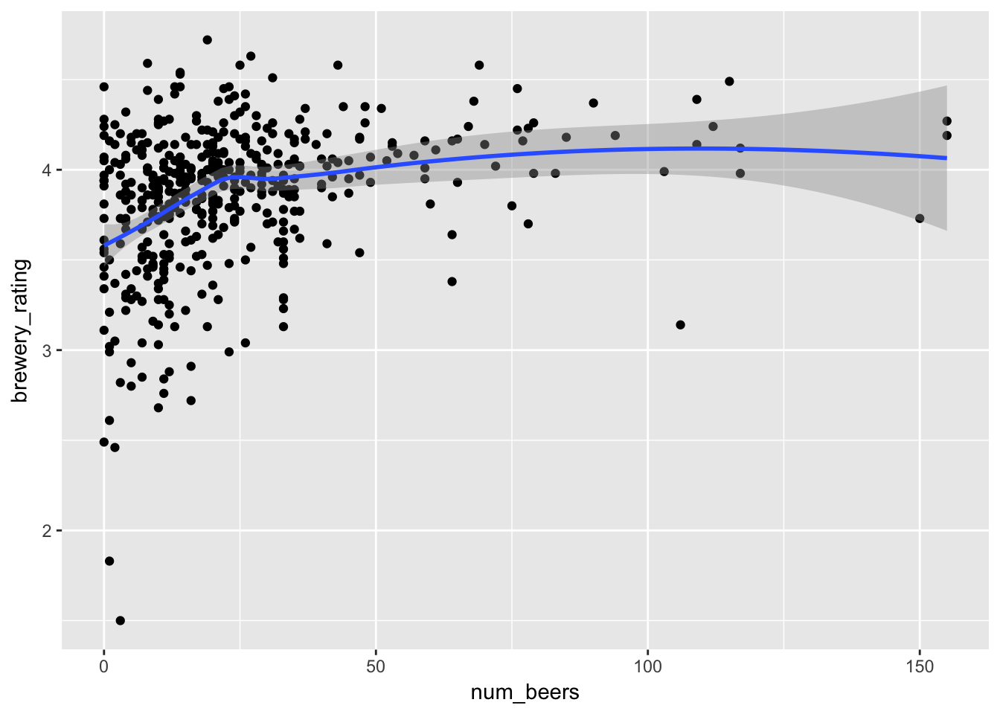
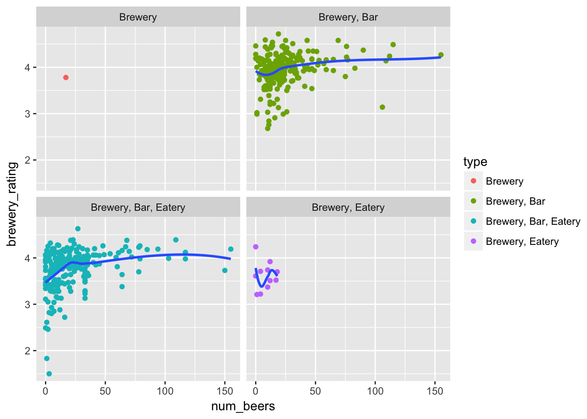

Data Visualization Using ggplot2
================
Jake Thompson
October 3, 2016

What is ggplot2?
----------------

ggplot2 is a data visualization package written by [Hadley Wickham](http://www.twitter.com/hadleywickham) that uses the "grammar of graphics." The grammar of graphics provides a consistent way to describe the components of graph, allowing us to move beyond specific types of plots (e.g., boxplot, scatterplot, etc.) to different elements that compose the plot. As the name would imply, the grammar of graphics is a language we can use to describe and build visualizations.

Today we'll be using data on US breweries (yay beer!) to explore some of ggplot2's capabilities. First, we will install the packages we will need.

``` r
# install.packages("devtools")
# install.packages("knitr")
# install.packages("maps")
# devtools::install_github("hadley/ggplot2")
# devtools::install_github("hadley/dplyr")
# devtools::install_github("hadley/purrr")
# devtools::install_github("hadley/tidyr")
# devtools::install_github("hadley/forcats")

library(ggplot2)
library(dplyr)
library(purrr)
library(tidyr)
library(forcats)
library(maps)
library(gganimate)
```

The dataset
-----------

The dataset contains the information on breweries across the United States scraped from [beer advocate](https://www.beeradvocate.com/). Information on the breweries includes the brewery name, brewery rating, the number of reviews, the average rating of their beers, the number of beers they serve, and location information.

``` r
load("all_breweries.RData")
all_breweries
#> # A tibble: 5,686 × 14
#>                  brewery_name brewery_rating num_reviews beer_avg
#>                         <chr>          <dbl>       <dbl>    <dbl>
#> 1                 603 Brewery             NA          NA     3.75
#> 2      7th Settlement Brewery           4.23          24     3.61
#> 3  Agner & Wolf Brewery Corp.             NA          NA     3.61
#> 4    Ashuelot Brewing Company             NA          NA       NA
#> 5            Bad Lab Beer Co.             NA          NA       NA
#> 6     Beara Irish Brewing Co.           4.12           5     3.60
#> 7        Belgian Mare Brewery             NA          NA     3.39
#> 8           Big Water Brewery             NA          NA     3.17
#> 9  Blackstone Brewing Company             NA          NA       NA
#> 10         Border Brew Supply           3.85          10     3.39
#> # ... with 5,676 more rows, and 10 more variables: num_beers <dbl>,
#> #   address <chr>, type <chr>, city <chr>, state <chr>, lon <dbl>,
#> #   lat <dbl>, full_city <chr>, city_lon <dbl>, city_lat <dbl>
```

Making a plot
-------------

Let's look at the relationship between the brewery's overall rating and the number of beers they serve.

``` r
brew_plot <- all_breweries %>%
  filter(!is.na(brewery_rating), !is.na(num_beers),
    state %in% c("Kansas", "Oklahoma", "Missouri", "Missouri", "Iowa",
      "Nebraska", "Colorado"),
    num_beers < 400)

ggplot(data = brew_plot) +
  geom_point(mapping = aes(x = num_beers, y = brewery_rating))
```


`ggplot()` initializes a blank plot, and then layers (geoms) are added to complete the plot. For example, `geom_point()` adds points to create a scatterplot. In the geom call, the user specifies which variable map to the x- and y-axes. We can create a general form all ggplot2 graphics:

``` r
ggplot(data = <DATA>) +
  <GEOM_FUNCTION>(mapping = aes(<MAPPINGS>))
```

Aesthetic mappings
------------------

``` r
ggplot(data = brew_plot) +
  geom_point(mapping = aes(x = num_beers, y = brewery_rating, color = type))
```


``` r

ggplot(data = brew_plot) +
  geom_point(mapping = aes(x = num_beers, y = brewery_rating, shape = type))
```


``` r

ggplot(data = brew_plot) +
  geom_point(mapping = aes(x = num_beers, y = brewery_rating, size = type))
#> Warning: Using size for a discrete variable is not advised.
```


``` r

ggplot(data = brew_plot) +
  geom_point(mapping = aes(x = num_beers, y = brewery_rating), color = "blue")
```


Inside of the `aes()` command, ggplot2 maps the aesthetic to a variable in your dataset and creates a legend. Outside of the `aes()` command, aesthetics can be fixed to a specific value. For a list of aesthetics that each geom can use, see the help page (e.g., `?geom_point`).

Common geoms
------------

``` r
ggplot(data = brew_plot) +
  geom_bar(mapping = aes(x = state))
```


``` r

ggplot(data = brew_plot) +
  geom_bar(mapping = aes(x = state, fill = type))
```


``` r

ggplot(data = brew_plot) +
  geom_bar(mapping = aes(x = state, fill = type), position = position_dodge())
```


``` r

ggplot(data = brew_plot) +
  geom_density(mapping = aes(x = num_beers))
```


``` r

ggplot(data = brew_plot) +
  geom_histogram(mapping = aes(x = num_beers), binwidth = 10)
```


``` r

ggplot(data = brew_plot) +
  geom_boxplot(mapping = aes(x = state, y = num_beers))
```


``` r

ggplot(data = brew_plot) +
  geom_violin(mapping = aes(x = state, y = brewery_rating))
```


Layering geoms
--------------

``` r
ggplot(data = brew_plot) +
  geom_point(mapping = aes(x = num_beers, y = brewery_rating))
```



``` r

ggplot(data = brew_plot) +
  geom_point(mapping = aes(x = num_beers, y = brewery_rating)) +
  geom_smooth(mapping = aes(x = num_beers, y = brewery_rating))
#> `geom_smooth()` using method = 'loess'
```



``` r

ggplot(data = brew_plot) +
  geom_histogram(mapping = aes(x = num_beers), binwidth = 10) +
  geom_density(mapping = aes(x = num_beers), alpha = 0.4, fill = "red")
```


Not all geoms are on the same scale! When using `geom_bar`, ggplot2 automatically calculates the count (i.e., the nubmer of occurances for each bin), and plots that on the y-axis. We can override this and make a different calculation for the y-axis.

``` r
ggplot(data = brew_plot) +
  geom_histogram(mapping = aes(x = num_beers, y = ..density..), binwidth = 10) +
  geom_density(mapping = aes(x = num_beers), alpha = 0.4, fill = "red")
```


Mapping in every geom can start to get redundant, so instead we can set global mappings.

``` r
ggplot(data = brew_plot, mapping = aes(x = num_beers, y = brewery_rating)) +
  geom_point() +
  geom_smooth()
#> `geom_smooth()` using method = 'loess'
```


You can also set local mappings that only apply to a specific layer.

``` r
ggplot(data = brew_plot, mapping = aes(x = num_beers)) +
  geom_histogram(mapping = aes(y = ..density..), binwidth = 10) +
  geom_density(alpha = 0.4, fill = "red")
```


``` r

ggplot(data = brew_plot, mapping = aes(x = num_beers, y = brewery_rating)) +
  geom_point(mapping = aes(color = type)) +
  geom_smooth()
#> `geom_smooth()` using method = 'loess'
```


We can similarly define which data should be used for a single geom.

``` r
ggplot(data = brew_plot, mapping = aes(x = num_beers, y = brewery_rating)) +
  geom_point(mapping = aes(color = type)) +
  geom_smooth(data = filter(brew_plot, type == "Brewery, Eatery"))
#> `geom_smooth()` using method = 'loess'
```


We can also show each subset individually using `facet_wrap()`.

``` r
ggplot(data = brew_plot, mapping = aes(x = num_beers, y = brewery_rating)) +
  geom_point(mapping = aes(color = type)) +
  geom_smooth(se = FALSE) +
  facet_wrap(~ type)
#> `geom_smooth()` using method = 'loess'
```



Formatting ggplot2
------------------

**Anything** you see in a ggplot2 visualization can be altered. Most of this will occur through the `theme()` function, but labels occur in `scale_` or `labs`. There is [extensive documentation](http://docs.ggplot2.org/current/) on what all can be altered. And chances are if there is something you want to change, someone has had the same question, and [asked it online](http://stackoverflow.com/questions/tagged/ggplot2).

``` r
ggplot(brew_plot) +
  geom_violin(mapping = aes(x = state, y = brewery_rating, fill = state)) +
  scale_x_discrete(labels = c("CO", "IA", "KS", "MO", "NE", "OK")) +
  scale_fill_brewer(type = "qual", palette = "Set3") +
  labs(x = "State", y = "Number of Beers",
    title = "How many beers do breweries make?",
    subtitle = "Few breweries sell over 50 beers",
    caption = "Data from beeradvocate.com") +
  theme_bw() +
  theme(plot.title = element_text(size = 12, face = "bold"),
        plot.subtitle = element_text(size = 10, face = "italic"),
        plot.caption = element_text(size = 6),
        axis.text = element_text(size = 8),
        axis.title = element_text(size = 10),
        axis.title.x = element_text(margin = margin(5, 0, 5, 0)),
        axis.title.y = element_text(margin = margin(0, 5, 0, 0)),
        legend.position = "none")
```


Saving graphics
---------------

We can also save plots using the `ggsave` function. By default this saves the last plot you created.

``` r
ggsave("Saved Images/Violin_Plot.png")
```

However you can also save your plots like you variable values and save them later.

``` r
p <- ggplot(data = brew_plot, mapping = aes(x = num_beers)) +
    geom_histogram(mapping = aes(y = ..density..), binwidth = 10,
    alpha = 0.6, color = "black", fill = "black") +
  geom_density(fill = "red", color = "black", alpha = 0.3) +
    labs(x = "Number of Beers", y = "Density",
      title = "Distribution of Number of Beers Sold",
      subtitle = paste0("All Breweries"),
      caption = "Data from beeradvocate.com") +
    theme_bw() +
    theme(plot.title = element_text(size = 12, face = "bold"),
        plot.subtitle = element_text(size = 10, face = "italic"),
        plot.caption = element_text(size = 6),
        axis.text = element_text(size = 8),
        axis.title = element_text(size = 10),
        axis.title.x = element_text(margin = margin(5, 0, 5, 0)),
        axis.title.y = element_text(margin = margin(0, 5, 0, 0)),
        legend.position = "none")

ggsave("Saved Images/All_States.png", plot = p)
```

This can work in conjunction with other packages from the [tidyverse](https://blog.rstudio.org/2016/09/15/tidyverse-1-0-0/), such as `purrr`. Here we make the same plot as above, except for each state individually. We can save each of these plots in a list, and then use `pwalk` to save them all at once.

``` r
plot_list <- unique(brew_plot$state) %>% list_along()
names(plot_list) <- unique(brew_plot$state)
for (i in seq_along(plot_list)) {
  plot <- ggplot(data = filter(brew_plot, state == names(plot_list)[i]),
                 mapping = aes(x = num_beers)) +
    geom_histogram(mapping = aes(y = ..density..), binwidth = 10,
    alpha = 0.6, color = "black", fill = "black") +
  geom_density(fill = "red", color = "black", alpha = 0.3) +
    labs(x = "Number of Beers", y = "Density",
      title = "Distribution of Number of Beers Sold",
      subtitle = paste0("Breweries in ", names(plot_list)[i]),
      caption = "Data from beeradvocate.com") +
    theme_bw() +
    theme(plot.title = element_text(size = 12, face = "bold"),
        plot.subtitle = element_text(size = 10, face = "italic"),
        plot.caption = element_text(size = 6),
        axis.text = element_text(size = 8),
        axis.title = element_text(size = 10),
        axis.title.x = element_text(margin = margin(5, 0, 5, 0)),
        axis.title.y = element_text(margin = margin(0, 5, 0, 0)),
        legend.position = "none")
  
  plot_list[[i]] <- plot
}

filenames <- paste0(names(plot_list), ".png")
pwalk(list(filenames, plot_list), ggsave,
      path = paste0(getwd(), "/Saved Images/"))
```

Endless possibilities
---------------------

Because geoms are layered, you aren't limited to certain types of pre-defined visualizations (e.g., scatterplots, barplots, etc.). You can continue to add layers to communicate information (or to increase aesthetic appeal).


You also aren't limited to the normal coordinate system. For example, you can map geospatial locations.


ggplot2 also has a strong online community of contributers that have written packages to [extend the capabilities](http://www.ggplot2-exts.org/gallery/) of ggplot2. For example, the `gganimate` package allows you to make animated visualizations.

``` r
brew_loc$brew_descrip <- case_when(
  brew_loc$num_brewery %in% 1:5 ~ "1-5 Breweries",
  brew_loc$num_brewery %in% 6:10 ~ "6-10 Breweries",
  brew_loc$num_brewery %in% 10:20 ~ "10-20 Breweries",
  brew_loc$num_brewery %in% 20:40 ~ "20-40 Breweries",
  brew_loc$num_brewery > 40 ~ "More than 40 Breweries"
)
brew_loc$brew_descrip <- fct_inorder(brew_loc$brew_descrip) %>% fct_rev()

p <- ggplot(data = brew_loc, mapping = aes(x = city_lon, y = city_lat,
    size = num_brewery, frame = brew_descrip)) +
  geom_polygon(data = states, mapping = aes(x = long, y = lat, group = group),
    color = "white", inherit.aes = FALSE) +
  geom_point(aes(x = city_lon, y = city_lat, size = num_brewery),
    color = "grey", alpha = 0.2, inherit.aes = FALSE) +
  geom_point(color = "red", alpha = 0.5) +
  scale_size_area(name = "Number of\nBreweries", breaks = seq(10, 60, 10)) +
  coord_map() +
  labs(title = "US Breweries: Cities with ") +
  theme_void() +
  theme(plot.title = element_text(size = 12, face = "bold",
                                  margin = margin(3, 0, 0, 0)),
        legend.position = "bottom",
        legend.title = element_text(size = 8),
        plot.margin = unit(c(0,0,0,0), "in")) +
  guides(size = guide_legend(nrow = 1))

gg_animate(p, interval = 2)
```


Other Resources
---------------

-   [Everything ggplot2](http://docs.ggplot2.org/current/)
-   [ggplot2: Elegant graphics for data analysis](https://github.com/hadley/ggplot2-book) (Hadley Wickham)
-   [R for Data Science: Data Visualization](http://r4ds.had.co.nz/data-visualisation.html) (Hadley Wickham & Garrett Grolemund)
-   [ggplot2 extensions](http://www.ggplot2-exts.org/gallery/)
-   ggplot2 vs. base graphics
    -   [Use base graphics!](http://simplystatistics.org/2016/02/11/why-i-dont-use-ggplot2/) (Jeff Leek)
    -   [Use ggplot2!](http://varianceexplained.org/r/why-I-use-ggplot2/) (David Robinson)
    -   [Comparing ggplot2 and base graphics](http://flowingdata.com/2016/03/22/comparing-ggplot2-and-r-base-graphics/) (Nathan Yau)
